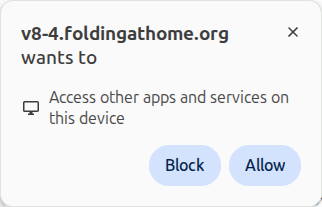
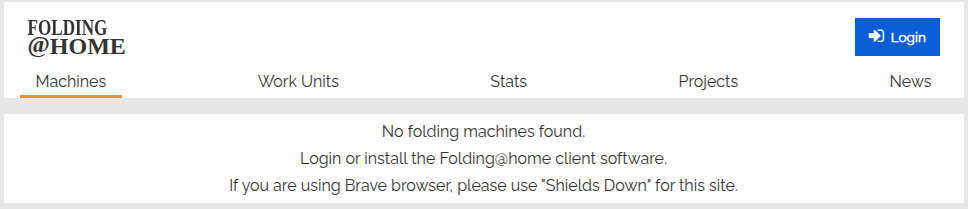
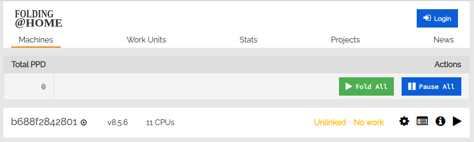
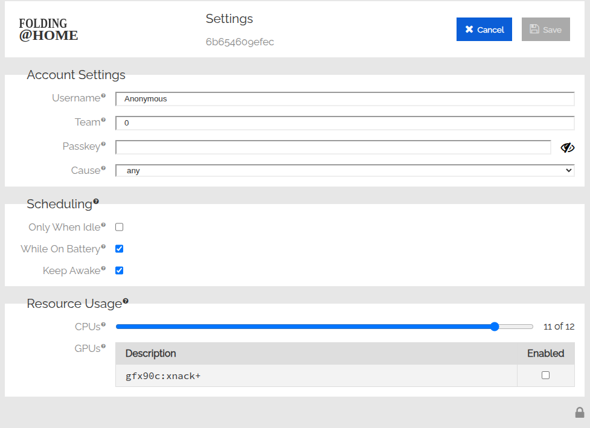
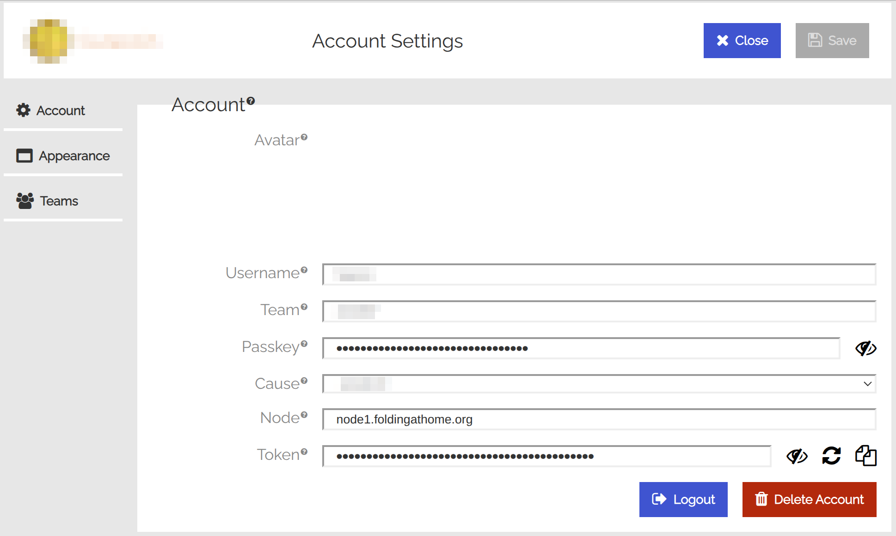

# Folding@home GPU Container for Bastet (FaH client v8.x)

## Goals

- Latest Docker image for the new FAH client, Bastet (v8.x).
- Support for nVidia, AMD, or both.
- Provides a sandbox testing environment for the new FAH client and core.


## Notes for those familiar with fah-client

- GPU drivers must be installed on the host machine since they are part of the OS kernel.
    - nVidia: A package with a name similar to `nvidia-driver-???`
    - AMD: In most cases, these are already included in the base kernel.
- If you are using an AMD GPU, pay attention to the `render` group ID associated with `/dev/dri/renderD*` permissions.
- Unlike FAH client v7, **fah-client Bastet does not read `config.xml`** after creating `client.db`.
- You should control fah-client via the [app.foldingathome.org](https://app.foldingathome.org/) web control or `fahctl` command.
    - Fah-client does not start folding by default.
    - You must enable GPUs and configure the number of CPU cores to use for folding.
    - For more details, see [V8.5 Client Guide](https://foldingathome.org/guides/v8-5#web-control).
- The V8 client recognizes *users* and their *machines* separately, as it is designed for cases where a single person uses multiple machines.
    - User data: username, team, passkey
    - User machine data: `/etc/machine-id`, machine name, account token
    - If `/etc/machine-id` is changed, previous folding works will be **invalid**.
- `Passkey` and `token` are different.
    - Passkey: evidence of who the **user** is
    - Token: **machine** password used to connect to foldingathome.org


## How to run on your desktop

### Using `docker run`

For the nVidia host machine
```bash
# Run container with GPUs, name it "fah0", map user and /fah volume
docker run --gpus all --name fah0 -d -p 127.0.0.1:7396:7396 --user "$(id -u):$(id -g)" \
  -v $HOME/fah:/fah -v /etc/machine-id:/etc/machine-id:ro \
  foldingathome/fah-gpu-bastet:cuda
```

For the AMD GPU host machine
```bash
docker run --device=/dev/kfd --device=/dev/dri \
  --security-opt seccomp=unconfined \
  --group-add video --group-add "$(getent group render | cut -d: -f3)" \
  --name fah0 -d -p 127.0.0.1:7396:7396 --user "$(id -u):$(id -g)" \
  -v $HOME/fah:/fah -v /etc/machine-id:/etc/machine-id:ro \
  foldingathome/fah-gpu-bastet:rocm
```

For both
```bash
docker run --gpus all --device=/dev/kfd --device=/dev/dri \
  --security-opt seccomp=unconfined \
  --group-add video --group-add "$(getent group render | cut -d: -f3)" \
  --name fah0 -d -p 127.0.0.1:7396:7396 --user "$(id -u):$(id -g)" \
  -v $HOME/fah:/fah -v /etc/machine-id:/etc/machine-id:ro \
  foldingathome/fah-gpu-bastet:cuda-rocm
```

Once the container starts, you can access it with [v8-4.foldingathome.org](https://v8-4.foldingathome.org/)


### Using `docker compose`

Before you begin, check the `compose-{platform}.yml` file and uncomment any option or change any options.

For the nVidia host machine
```bash
docker compose -f compose-cuda.yml up -d
```

For the AMD GPU host machine
```bash
export RENDER_GID="$(getent group render | cut -d: -f3)"
docker compose -f compose-rocm.yml up -d
```

For both
```bash
export RENDER_GID="$(getent group render | cut -d: -f3)"
docker compose up -d
```

**Note:** You can set the `RENDER_GID` variable in your `.env` file.
```sh
RENDER_GID=999  # replace 999 with your machine's render group ID
```

## Configure & control the FAH client

FAH client V8, code name "Bastet", is a complete rewrite of the Folding@home client software.
Therefore, the way to configure and control the client is different from V7.

The major changes are as follows:
- You can manage multiple FAH client machines via the Web Control by creating a user account at [app.foldingathome.org](https://app.foldingathome.org/).
    - After installing the client, you can control it from anywhere by simply registering the owner.
- The new client is designed to be controlled via network APIs. Currently, only the Web Control fully utilizes network APIs.
- Configurations are stored in `client.db` rather than `config.xml`. Values of `config.xml` are applied only when new values are created in `client.db`.
    - Changing and controlling settings via the Web Control is recommended, as the existing method of modifying the `config.xml` file is very inconvenient.
- The Web Control searches a local client via `localhost:7396`.
    - You can immediately configure and control the client settings by opening a browser on the PC where the client is installed and accessing `app.foldingathome.org`.
    - If you open a browser while logged in to the Web Control, the client is registered as the user's machine, allowing you to monitor or control the client's status from other sites later.
    - If you cannot open a browser on the PC where the client is installed, you must establish a user-computer connection using another method. (Explained in Headless Setup)
- The client connects to the Folding@home node (e.g., `node1.foldingathome.org`) to send processing information and receive control information.

### If you can run a web browser on the client machine

Just run a web browser and go to [app.foldingathome.org](https://app.foldingathome.org/).

You may encounter a browser warning pop-up like the following;



In this case, simply select 'Allow'.
This pop-up appears because the Web Control attempts to connect to `localhost:7396`.

If you see the following message indicating that the folding machine cannot be found, the Web Control cannot access `localhost:7396`.
Verify that the FAH client is running and check if you can connect to localhost:7396 using a tool such as `curl`.



The machine status is displayed as follows if the local client is running normally.
The screen below shows the status when the user is not logged in.



To connect your FAH account to your machine, press the 'Login' button to log in.
The machine will be registered to your account immediately,
and your account information, such as username, team, password, and cause to support, will be applied to your machine.
Additionally, you can check the status or control the connected machine remotely.

To set up your machine without connecting an account as before, click the 'Gear' icon.
On the next screen, enter your information as before and press the Save button to complete the setup.
Afterward, you can press the 'Play' icon to start the folding.



### If you **cannot** run a web browser on the client machine (Headless Setup)

Since the only way to fully control the client is by using the Web Control,
it is best to control the client remotely via a FAH account
if you cannot run a web browser on the computer where the client is installed.

In this case, you should connect the FAH client and the user account **manually** since the automatic connection occurs only when the browser and the client are in the same host.

To link the client to your account, you should obtain an **account token** from the bottom line of the 'Account Settings' page. (See the following image)
To navigate to the Account Settings page, click the user icon in the upper right corner while logged in.



Provide the account token to fah-client by creating a `config.xml` file as follows.
The `config.xml` file must be located in the fah-client's working directory and prepared before running fah-client for the first time.

```xml
<config>
  <account-token v="<your account token>"/>
  <machine-name v="<a display name for this machine>"/>
</config>
```

After running fah-client, the machine will be added to the Web Control.
If it is not added, check the `log.txt` file in the fah-client working directory to identify the error.

Once the client is added to the account, you can delete the `config.xml` file. This is because the values ​​in the `config.xml` file are ignored once values ​​are added to `client.db`.

Additionally, it is recommended to update the exposed account token
when creating the `config.xml` file
after the machine has been added to the account.

If you wish to operate the client without connecting to a FAH account,
you can set user information via the `config.xml` file, just as with the existing method.
However, only input is allowed; modifications are not permitted.
Additionally, since folding is disabled by default,
you must use the `fahctl` command to initiate folding.

Although the resource management method has changed and several settings have been added,
modifications are currently only available through Web Control,
making it inconvenient to use the client without a FAH account.

## How to build a custom image

To build an image, you must provide the `FAH_CLIENT_VERSION` and `FAH_CLIENT_SHA256SUM`
environment variables to specify which version of fah-client to install.
If you are unsure about the details, simply copying the `.env-example` file into `.env` is sufficient.

You can also set CUDA and ROCm versions in the `.env` file to build a custom image.
Note that `docker compose` reads the `.env` file and sets environment variables.
Please check the `.env-example` file as an example.

For the nVidia host machine
```bash
docker compose -f compose-cuda.yml build --pull
```

For the AMD GPU host machine
```bash
docker compose -f compose-rocm.yml build --pull
```

For both
```bash
docker compose build --pull
```


## Maintenance Tips

You can reduce the size of the `client.db` file **when fah-client is not running** by running this command:
```bash
sqlite3 client.db "VACUUM;"
```
